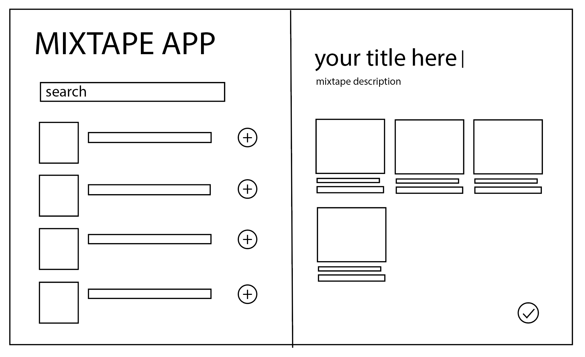
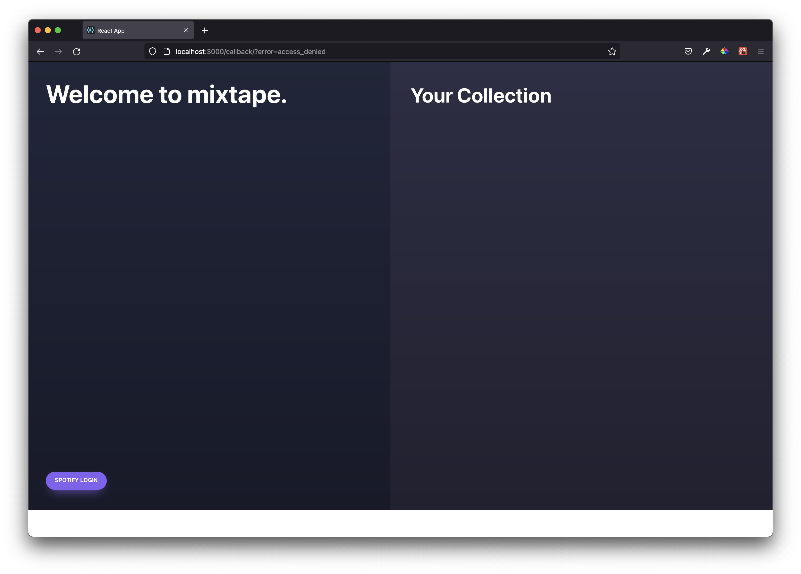
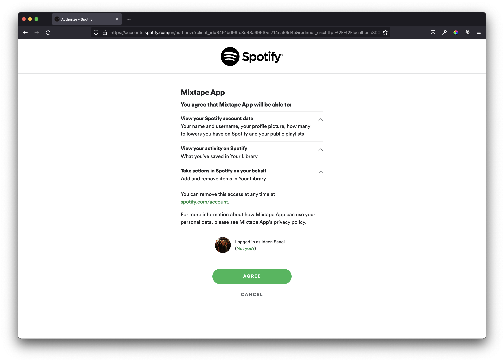
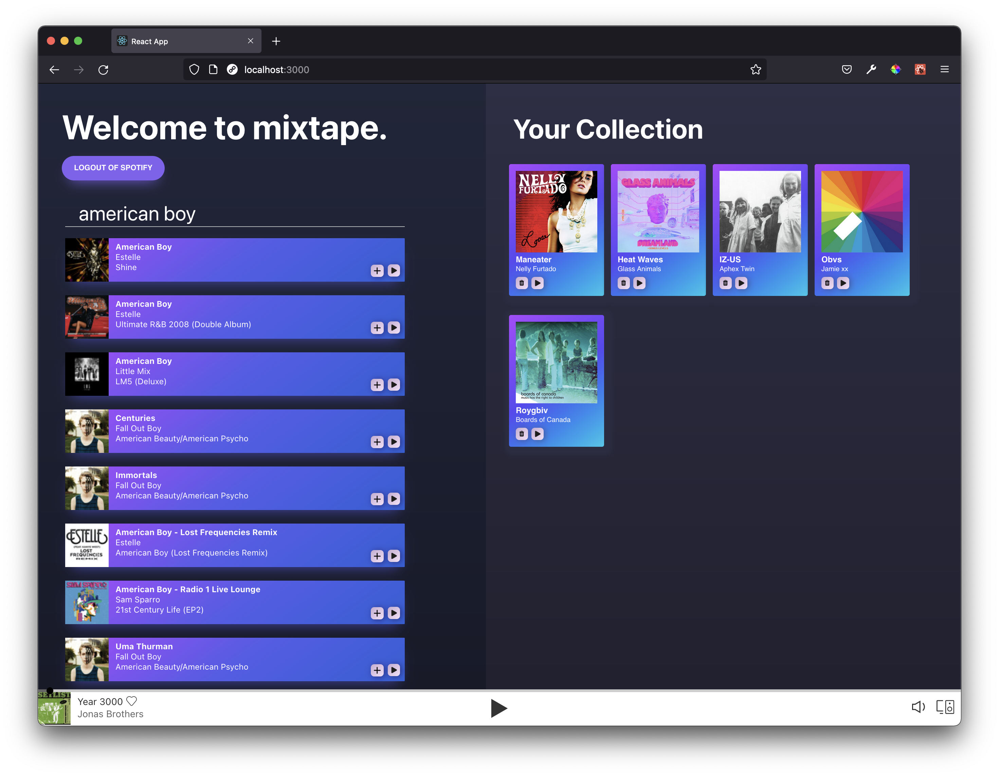

#Mixtape

## Project Overview

This project was the second project I completed during my Software Engineering Immersive course at General Assembly. This project was a pair project and its objective was making a web app that Utilized RESTful APIs to provide the user information.

## Deployment:

This project was made using the Spotify API and is still in developer mode. This means that its features are inaccessible to the public.

## How to download:

The projects’ files can be downloaded but the web app itself will not be functional because of Spotify developer mode. The files can be accessed here: [GitHub](https://github.com/sungchun/mixtape).

- If you want to clone the repository:
  1. Click the button labeled ‘Code’.
  2. On the dropdown menu select HTTPS and copy the link provided.
  3. Using the terminal, navigate to where you want to clone the repository and execute the command: “git clone (copied HTTPS link)”
- If you want to download the ZIP file:
  1. Click the button labeled ‘Code’
  2.Click the ‘Download ZIP’ button on the dropdown menu.

## Goal and Timeframe:

The goal of this project was to create a web app that utilizes APIs within 60 hours.

## Technology Used:

HTML5
CSS3
JavaScript
React
Git

## App Flow:

Mixtape is a web app that allows the user to search and listen to music so they can add songs they like to a playlist. 

Searching for and playing music is done using the Spotify API. The returned music is displayed on the left of the page. Buttons next to each song allow the user to add them to their playlist on the right.

## Process

### Planning

My partner and I decided that we wanted to do a project that was challenging and interesting, this led us to choosing a shortlist of APIs that use OAuth2.0 authentication.



The next step was to plan how we wanted the app to look. We decided that we wanted the web app to have one main feature, finding music. Because of this we wanted Mixtape to be simple and take place all on one page. We settled on the wireframe pictured above, with the song search placed on the left and the user’s mixtape on the right.

My partner and I decided that the best way to work on the project was to have one person coding while they share their screen on Zoom. We decided that this was the best course because our project consisted of a few very challenging stages as opposed to many different tasks. Working together on the same issues helped us to find solutions faster because we could exchange ideas or one person could research the issue online while the other was coding. To communicate, my partner and I were working together in a Zoom breakout room for the entire project. If we needed to communicate outside of normal hours we would message each other on Slack.

### Authentication

After my partner and I decided to use the Spotify API for our project we needed to learn how to use OAuth 2.0 authentication. 

The first thing that my partner and I did was research how the Spotify API did authentication. We learned that there are various methods to authenticate requests to the Spotify API and eventually decided that the one most suited for our project was Implicit Grant.


Implicit Grant requires the user to request authorization to make requests and access the Spotify API’s data. This requires the user to login to Spotify, after a successful login the Spotify API returns the user’s access token in the URL hash. 

The code snippet featured below explains how we took this access token to make requests in our web app.

```
      function getSpotifyParams(hash) {
        const urlString = hash.substring(1)
        const relevantParams = urlString.split('&')
        const splitParams = relevantParams.reduce((accumulate, currentValue) => {
            const [key, value] = currentValue.split('=')
            accumulate[key] = value
            return accumulate
        }, {})

        console.log("splitparams", splitParams)
        return splitParams
    }

    useEffect(() => {
        if (window.location.hash) {
            console.log("use effect if statement reached")
            const { access_token, expires_in, token_type } = getSpotifyParams(window.location.hash)
            localStorage.clear()
            setAccessToken(access_token)
            setTokenType(token_type)
            setExpiry(expires_in)
            console.log("the access stuff", access_token, expires_in, token_type)
            history.push('/')
        }
    })
```

- After the user logins to their Spotify account, the Spotify redirects the user and puts the authentication information in the URL hash.
    - The URL hash includes the name of the information (‘access_token’, ‘expires_in’ etc) and the information itself.
    - ‘getSpotifyParams’ is a function that takes the information in the hash and puts it into an object as key value pairs, it then returns the object.
- The useEffect runs if a hash is detected in the URL.
    - It runs the ‘getSpotifyParams’ function and puts the authentication information from the ‘spliParams’ object into local storage.

### Songs Request

This is how the app returned songs that the user searched for.

```
     const handleGetMusic = (event) => {
        event.preventDefault()
        axios.get(`${musicEndpoint}${search}&type=track`, {
            headers: {
                Authorization: `Bearer ${localStorage.getItem('accessToken')}`,
            },
        })
            .then((response) => {
                const listOfTracks = response.data.tracks.items.map((track) => {
                    return {
                        track_id: track.id,
                        artist_name: track.artists[0].name,
                        track_name: track.name,
                        album_art: track.album.images[2],
                        album_art_bigger: track.album.images[1],
                        album_name: track.album.name
                    }
                })
                console.log(listOfTracks)
                setTrackData(listOfTracks)
            })
            .catch((err) => {
                console.error('error fetching music', err)
            })
    }

```

- When the user types into the search bar, ‘handleSearchChange’ is triggered changing the state of the search terms.
- When the user submits their search it triggers ‘handleGetMusic’ which creates a request to the Spotify API.
    - When a response is returned the ‘TrackData’ state is set to an array of objects with the information of each song returned.

```
    <ul className='song-card-list'>
                    {trackData.map((song) => (
                        <li className='song-card-list-item' key={song.track_id}>
                            <SongCard {...song} userSongs={userSongs} setUserSongs={setUserSongs} setPlayID={setPlayID} />
                        </li>
                    ))
                    }
                </ul>
```

- The ‘trackData’ state is mapped over returning a list of React components called ‘SongCard’ that displays all the song information.

### The Mixtape
    
Each song had a corresponding button which added said the corresponding song to their playlist.

```
    function takeSong() {
        setUserSongs([...userSongs, {
            trackName: track_name,
            artistName: artist_name,
            albumArt: album_art_bigger,
            albumName: album_name,
            id: track_id
        }])
    }

    function handlePlay() {
        console.log(track_id)
        setPlayID([`spotify:track:${track_id}`])
    }

    return (
        <div className='song-card'>
            <div className='track-image'>
                
                {
                    (userSongs.some((track) => { return track.id === track_id })) ? (<p>Added!</p>) :
                        (<button className='add-button' onClick={takeSong}></button>)
                }
            </div>
            <div className='track-text'>
                <h3 className='song-name'>{track_name}</h3>
                <p className='artist-name'>{artist_name}</p>
                <p className='album-name'>{album_name}</p>
            </div>
            <div className='track-play-button'>
            <button className='play-button' onClick={handlePlay}></button>
            </div>
        </div>
    )
```

- ‘userSongs’ is a state defined globally. It is an array of all the songs the user has in their playlist.
- ‘setUserSongs’ is passed to this ‘SongCard’ component and is updated with ‘takeSong’ whenever the add button is clicked.
- The ‘some’ method is run on ‘userSongs’ to see if a song is already in the user’s playlist.
    - Using a ternary statement, if a song is in the user’s playlist the card displays ‘Added!’
    - If the song has not yet been added the card displays the ‘add song’ button.

Here are images from the final project:







## Bugs

The major known bugs are as follows:
Only the registered owner of the web app can access it and use it.
If another user tries to use it, the music player will not be authorized and will not render.
Only those manually registered by the admin are authorized to use the app.

## Wins
Before this project I had never heard of OAuth2.0, and after studying I was able to understand how to implement Implicit Grant into our project and successfully authorize Spotify API requests. Furthermore, this was done using JavaScript as opposed to a third-party technology or service. Writing the solution myself made this endeavor even more satisfying. 

## Challenges

The biggest challenges I faced during this project were learning and implementing OAuth2.0 and learning how to implement the Spotify Player. Completing the authentication for this project required a lot of research of the Spotify API documentation as well as examples of code which worked with OAuth2.0. 

## Takeaways

This project taught how to use OAuth 2.0 as well as greatly improve my proficiency in react. My key takeaways are:
Using the ‘reduce’ method to create an object of authorization information.
Gained understanding of how to create react components and pass props.


## Future Improvements
 
If I were to improve this web app, I would add the following features:
A ‘share’ feature, so the user can share their playlist with others.
Allow the user to add the playlist to their Spotify account.

